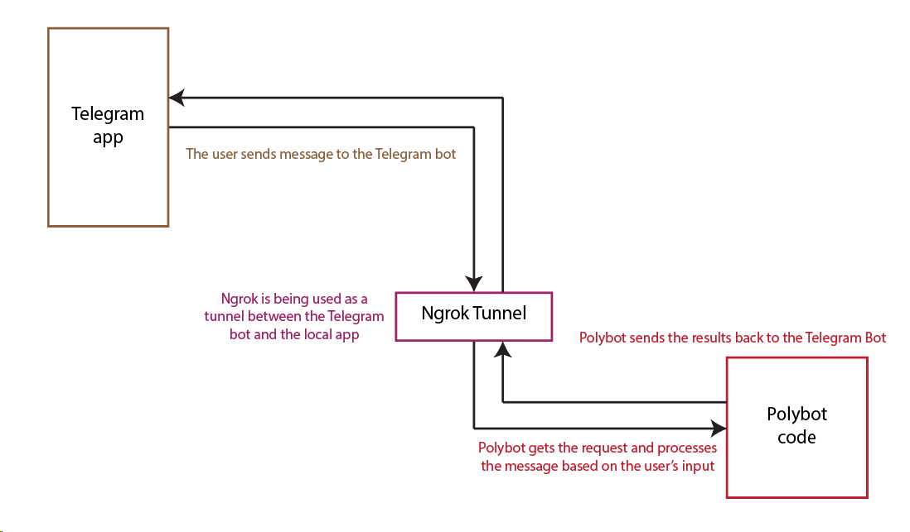

# Python Project

In the Python project, I implemented the logic for handling bot filters and methods.
The Telegram bot receives both messages and photos, processes them, and responds accordingly.
When it receives a color photograph, it converts the image to black and white and sends it back.
To expose the application to the internet, we used Ngrok to create a secure tunnel.

## Ngrok Tunnel  
I used Ngrok to expose a local server to the internet securely through a secure tunnel.

## Polybot  
For the project, I worked with a few files:  
- app.py- It contains the URL's endpoints and calls the ImageProcessingBot method.  
- Bot.py- I developed the logic to call the appropriate method based on the user's photo caption, along with handling text processing when no photo is provided.
- Img_proc.py- I programmed the logic for the filters themselves.  
- requirements.txt- Contains project-specific requirements.  
- responses.json- Contains possible sentences to utilize when the user sends specific words.
- responses.py- Imports a JSON file into the project.

In the project, I decided to implement the following filters:
- Blur 
- Contour 
- Rotate 
- Salt and Pepper 
- Segment 
- Random Colors   

## Operating Systems
- Linux (Ubuntu)

## Programming Languages
- Bash Scripting  
- Python Scripting

## Version Control
- Git  
- GitHub

## Networking
- Ngrok
  
## Automation and Configuration Management:
- JSON
